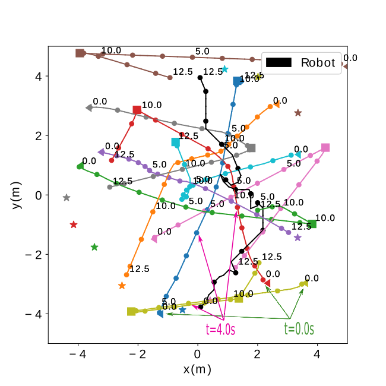
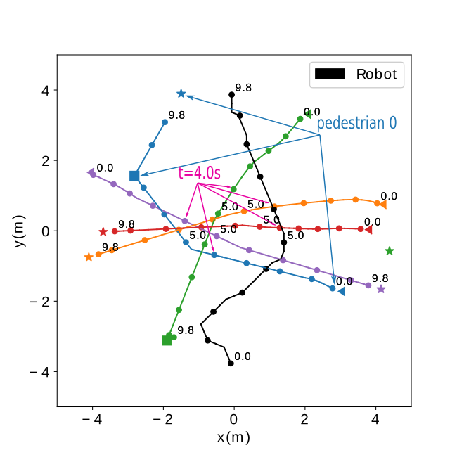
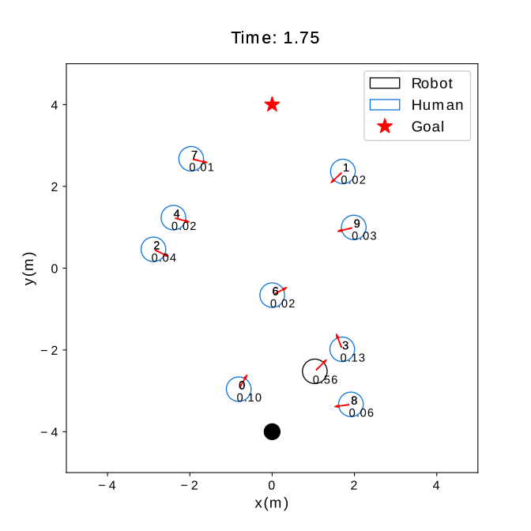
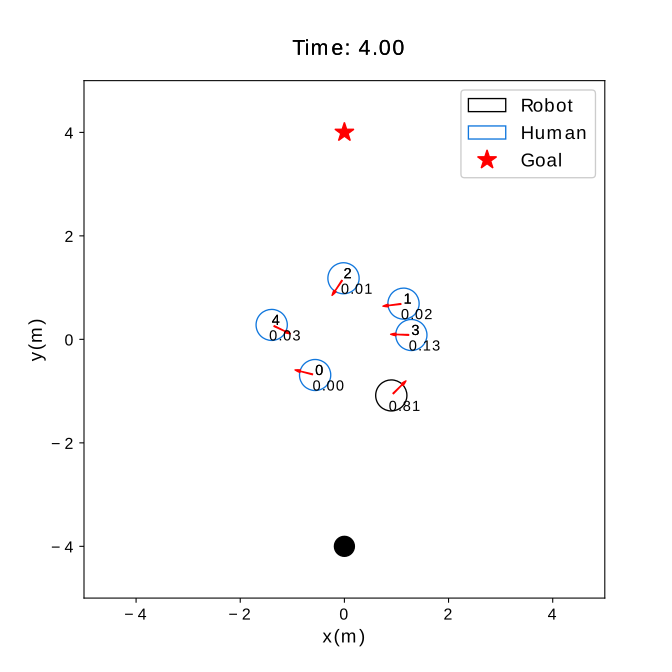

# SG-DQN
This repository contains the codes for our paper, which is in submission to RA-L and IROS 2021. 


## Abstract
we propose a graph-based deep reinforcement learning method, SG-DQN, that (i) introduces a social attention mechanism to extract an efficient graph representation for the crowd-robot state; (ii) directly evaluates the coarse q-values of the raw state with a learned dueling deep Q network(DQN); and then (iii) refines the coarse q-values via online planning on possible future trajectories. The experimental results indicate that our model can help the robot better understand the crowd and achieve a high success rate of more than 0.99 in the crowd navigation task. Compared against previous state-of-the-art algorithms, our algorithm achieves an equivalent, if not better, performance while requiring less than half of the computational cost.

## Method Overview


## Setup
1. Install [Python-RVO2](https://github.com/sybrenstuvel/Python-RVO2) library
2. Install [socialforce](https://github.com/ChanganVR/socialforce) library
2. Install crowd_sim and crowd_nav into pip
```
pip install -e .
```

## Getting Started
This repository are organized in two parts: crowd_sim/ folder contains the simulation environment and crowd_nav/ folder contains codes for training and testing the policies. Details of the simulation framework can be found [here](crowd_sim/README.md). Below are the instructions for training and testing policies, and they should be executed
inside the crowd_nav/ folder.


1. Train a policy.
```
python train.py --policy tree-search-rl
```
2. Test policies with 1000 test cases.
```
python test.py --model_dir data/output 
```
3. Run policy for one episode and visualize the result.
```
python test.py --policy tree-search-rl --model_dir data/output --phase test --visualize --test_case 0
```
## Trajectory Diagram

<figure class="half">
   
   
</figure>

## Attention Weights

<figure class="half">
   
   
</figure>

## Video Demo

<video src="doc/demo.mp4"></video>

