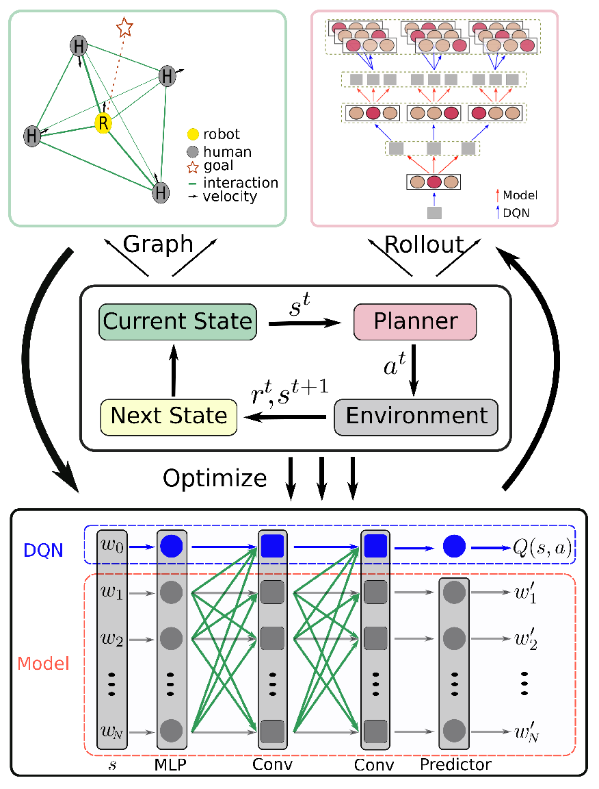
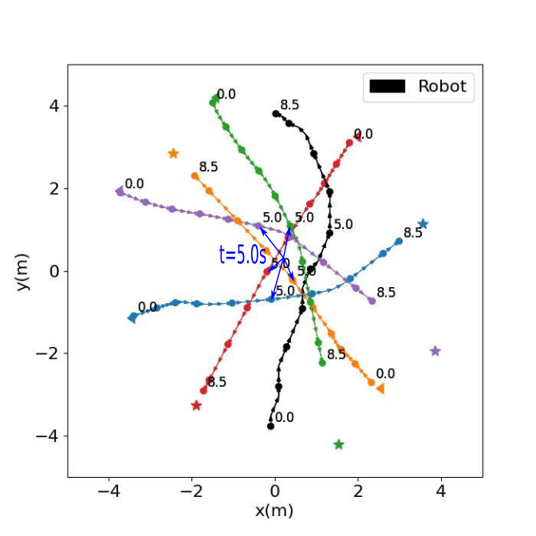
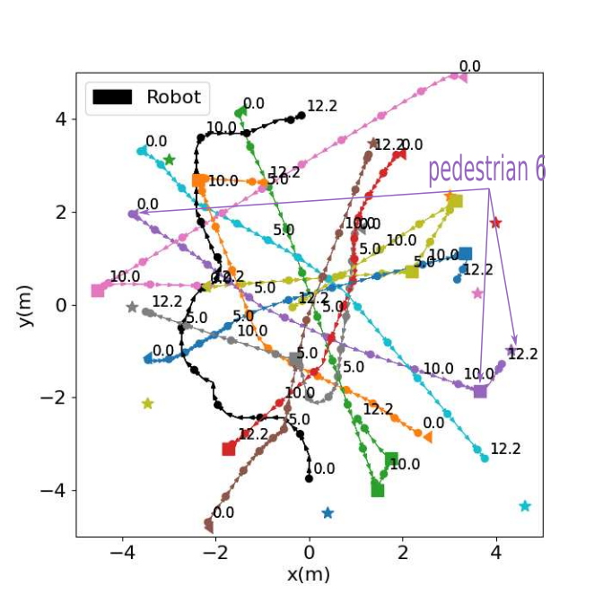
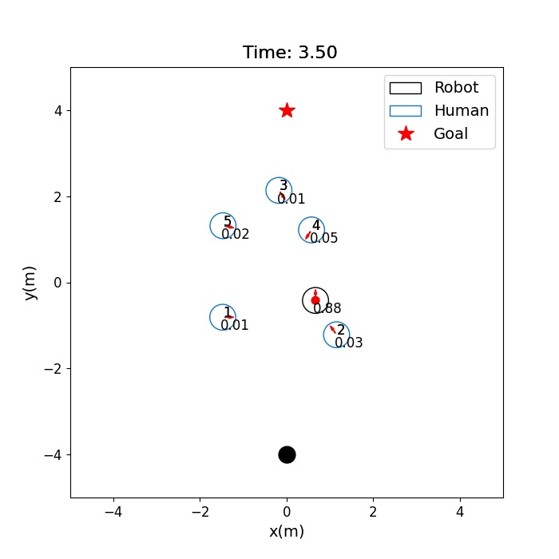
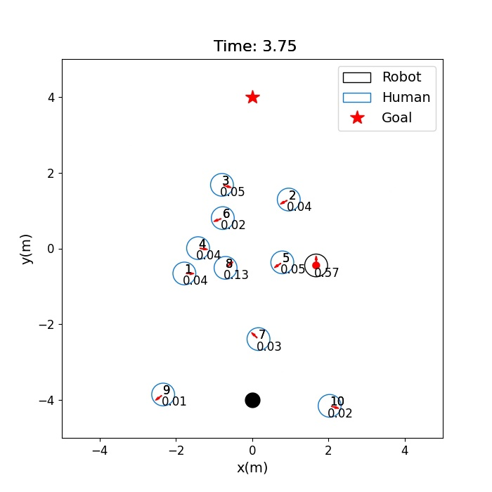
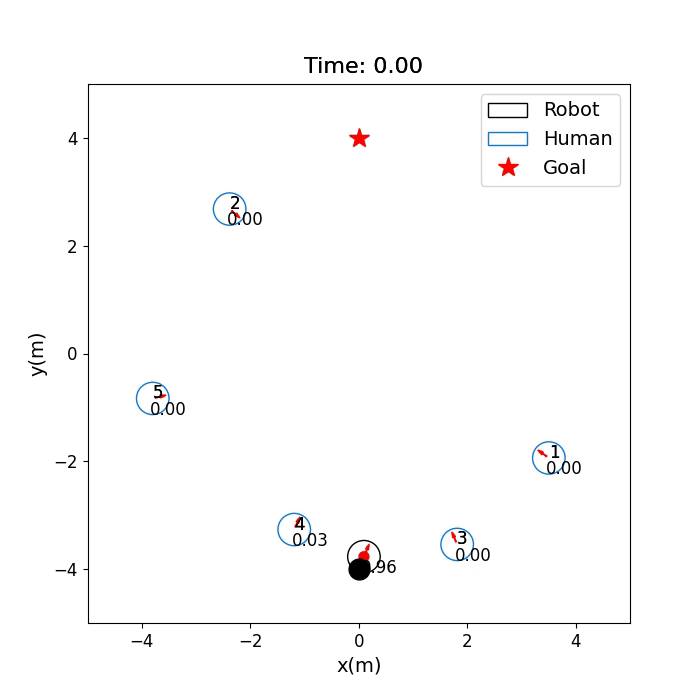
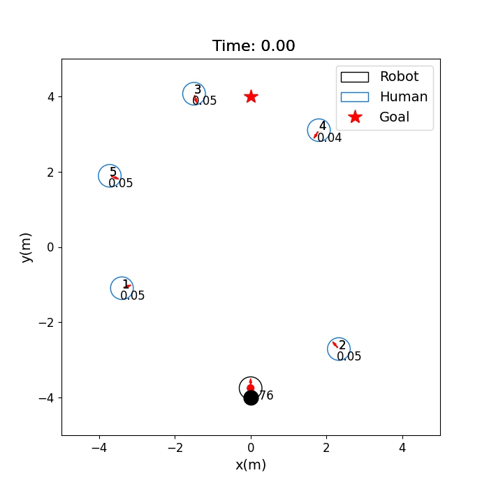
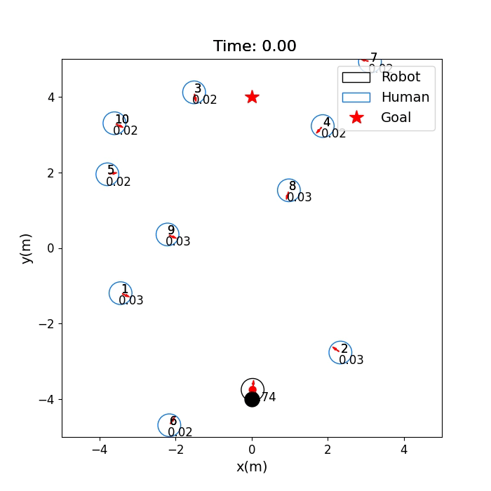

# SG-D3QN

This repository contains the codes for our paper, which is in submission. The demo vedio can be found in doc folder.


## Abstract
We propose a graph-based deep reinforcement learning method, \textcolor{blue}{social graph-based double dueling deep Q-network (SG-D3QN)}, that (i) introduces a social attention mechanism to extract an efficient graph representation for the crowd-robot state, (ii) extends the previous state value approximator to a state-action value approximator, (iii) \textcolor{blue}{further optimizes the state-action value approximator with simulated experiences generated by the learned environment model, and (iv) then proposes a human-like decision-making process by integrating model-free reinforcement learning and online planning.} Experimental results indicate that our approach helps the robot understand the crowd and achieves a high success rate of more than 0.99 in the crowd navigation task. Compared with previous state-of-the-art algorithms, our approach achieves better performance. Furthermore, with the human-like decision-making process, our approach incurs less than half of the computational cost.
## Method Overview


## Setup
1. Install [Python-RVO2](https://github.com/sybrenstuvel/Python-RVO2) library
2. Install [socialforce](https://github.com/ChanganVR/socialforce) library
2. Install crowd_sim and crowd_nav into pip
```
pip install -e .
```

## Getting Started
This repository are organized in two parts: crowd_sim/ folder contains the simulation environment and crowd_nav/ folder contains codes for training and testing the policies. Details of the simulation framework can be found [here](crowd_sim/README.md). Below are the instructions for training and testing policies, and they should be executed
inside the crowd_nav/ folder.

1. Train a policy.
```
python train.py --policy tree-search-rl
```
2. Test policies with 1000 test cases.
```
python test.py --model_dir data/output 
```
3. Run policy for one episode and visualize the result.
```
python test.py --policy tree-search-rl --model_dir data/output --phase test --visualize --test_case 0
```
Note that **run_experiments_main.sh** in built to train all policy automatically.
## Trajectory Diagram
|              Simple Scenario               |              Complex Scenario              |
| :----------------------------------------: | :----------------------------------------: |
|  |  |
## Attention Weights

|                Simple Scenario                |               Complex Scenario                |
| :-------------------------------------------: | :-------------------------------------------: |
|  |  |

## Video Demo

|                Holonomic Robot in Simple Scenarios                 |                Rotation-Contrained Robot in Simple Scenarios               |
| :--------------------------------------------: | :--------------------------------------------: |
|  |  |
|         **Holonomic Robot in Complex Scenarios**   |    **Rotation-Contrained Robot in Complex Scenarios**     |
|  |  |

## Acknowledge
This work is based on [CrowdNav](https://github.com/vita-epfl/CrowdNav) and [RelationalGraphLearning](https://github.com/ChanganVR/RelationalGraphLearning).  The authors thank Changan Chen, Yuejiang Liu, Sven Kreiss, Alexandre Alahi, Sha Hu, Payam Nikdel, Greg Mori, Manolis Savva for their works.

